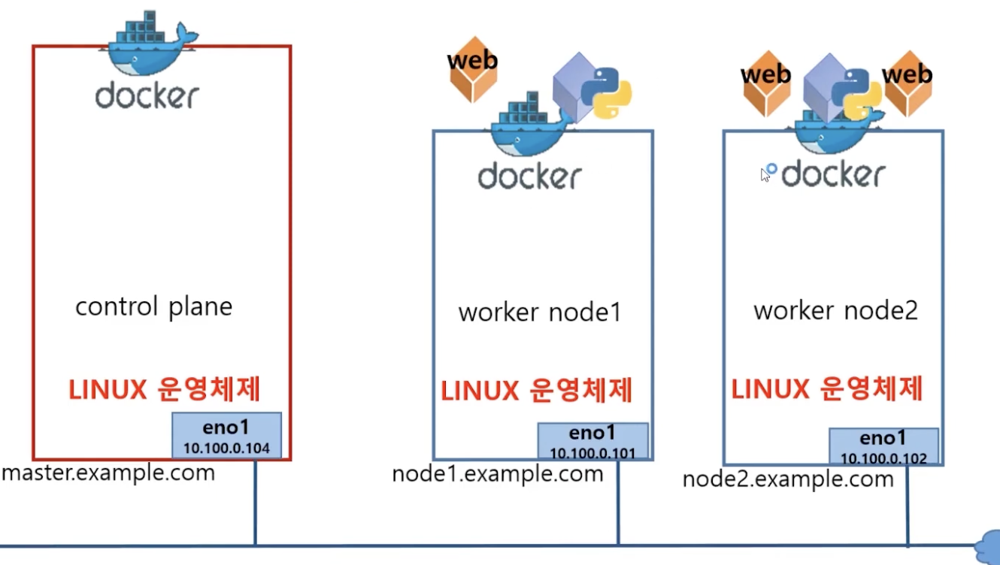

# 쿠버네티스 소개

컨테이너의 목적: 배포

가상머신은 하드웨어를 N개 늘리고 배포해야하는데 컨테이너는 App만 배포하면 됨.

사이즈도 작고 속도도 빠름.

### 컨테이너 오케스트레이션

: 여러개의 컨테이너를 잘 배치해서 잘 동작할 수 있도록 함

**오케스트레이션** 

지휘자의 지휘를 볼 수 있도록 지휘자가 잘 배치했다.

왼쪽이 마스터 컨테이너 = ***control plan***

work node 들이 잘 동작할 수 있도록 배치하고 관리한다.

쿠버네티스 공홈에서 다양한 정보를 볼 수 있다.

[https://kubernetes.io/ko/](https://kubernetes.io/ko/)

- 구글이 만듦
- 그리스어이고, 조타수 라는 뜻
- cncf: [https://www.cncf.io/](https://www.cncf.io/)

k8s 특징

- 어디서나 실행 가능 (yaml 파일만 가지고 플랫폼 갈아탈 수 있따)
- 선언적 API
    
    
    
    - = 쿠버야 나 웹서거 3개 실행해줘!
    - 3개가 돌다가 하나가 죽으면 다시 실행해주고~
    - 이 장점이 너무 큼
        - DevOps, NoOps 가 가능해진다