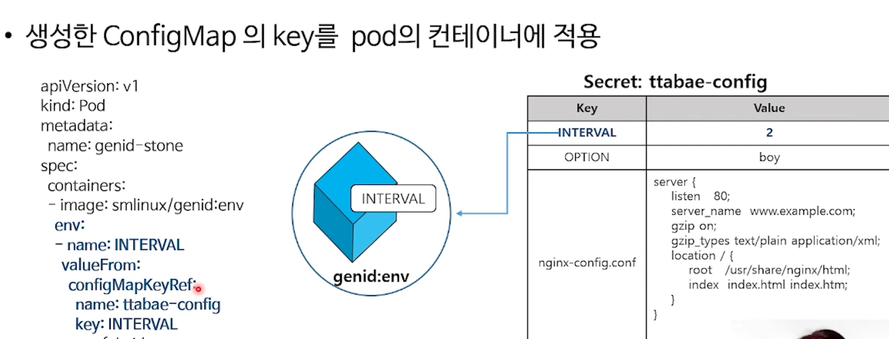

# 10. ConfigMap

태그: ConfigMap

# ConfigMap

- 컨테이너 구성 정보를 한 곳에 모아서 관리
- 여러 리소스들의 공통된 구성 정보가 바뀔 때 일일히 바꿔주면 관리가 어려울 수 있다. configMap 을 활용하면 한 군데에서만 관리하면 돼서 좋다.

```bash
kubectl create configmap NAME [--from-file=source] [--from-literal=key1=value1]
```


### > 실습

### configmap 만들기

```bash
kubectl create configmap ttabae-config --from-literal=INTERVAL=2 --from-literal=OPTION=boy --from-file=config.dir/
```

yaml로 만들 수 도 있다.

### configmap 적용하기



1. 

```bash
# cat genid.yaml

apiVersion: v1
kind: Pod
metadata:
  name: genid-stone
spec:
  containers:
  - image: smlinux/genid:env
    **env:**
    **- name: INTERVAL
      valueFrom:
        configMapKeyRef:
          name: ttabae-config
          key: INTERVAL**
    name: fakeid
    volumeMounts:
    - name: html
      mountPath: /webdata
  - image: nginx:1.14
    name: web-server
    volumeMounts:
    - name: html
      mountPath: /usr/share/nginx/html
      readOnly: true
    ports:
    - containerPort: 80
  volumes:
  - name: html
    emptyDir: {}
```

1. 

```bash
# genid-whole.yaml

apiVersion: v1
kind: Pod
metadata:
  name: genid-boy
spec:
  containers:
  - image: smlinux/genid:env
    **envFrom:
    - configMapRef:
        name: ttabae-config**
    name: fakeid
    volumeMounts:
    - name: html
      mountPath: /webdata
  - image: nginx:1.14
    name: web-server
    volumeMounts:
    - name: html
      mountPath: /usr/share/nginx/html
      readOnly: true
    ports:
    - containerPort: 80
  volumes:
  - name: html
    emptyDir: {}
```

실행된 ‘genid-boy’의 env 확인

```bash
kubectl exec genid-boy -- env
```

1. 

```bash
# cat genid-volume.yaml                                                       ✔
apiVersion: v1
kind: Pod
metadata:
  name: genid-volume
spec:
  containers:
  - image: smlinux/genid:env
    **env:
    - name: INTERVAL
      valueFrom:
        configMapKeyRef:
          name: ttabae-config
          key: INTERVAL**
    name: fakeid-generator
    volumeMounts:
    - name: html
      mountPath: /webdata
  - image: nginx:1.14
    name: web-server
    ports:
    - containerPort: 80
    volumeMounts:
    - name: html
      mountPath: /usr/share/nginx/html
      readOnly: true
    - name: config
      mountPath: /etc/nginx/conf.d
      readOnly: true
  volumes:
  - name: html
    emptyDir: {}
  - name: config
    configMap:
      name: ttabae-config
      items:
      - key: nginx-config.conf
        path: nginx-config.conf
```