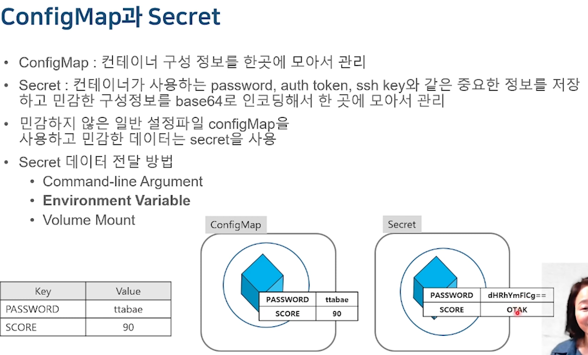
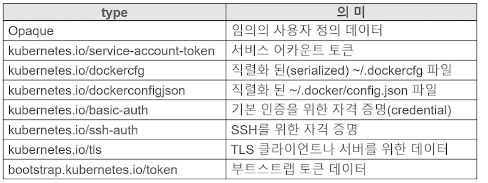

# 11. Secret

태그: Secret



```bash
kubectl create secret <Available Commends> name [flags] [options]
```

- Available Commends: docker-registry / generic / tls
    - 셋 중 하나는 꼭 선택해서 써야한다.

## 실습

```bash
kubectl create secret generic ttabae-secret --from-literal=INTERVAL=2 --from-literal=OPTION=boy --from-file=genid-web-config/
```

```bash
$ kubectl get secrets                                                     
NAME            TYPE     DATA   AGE
ttabae-config   Opaque   3      12s
```



```bash
# cat genid-env-secret.yaml

apiVersion: v1
kind: Pod
metadata:
  name: genid-env-secret
spec:
  containers:
  - image: smlinux/genid:env
    **env:
    - name: INTERVAL
      valueFrom:
        secretKeyRef:
          name: ttabae-secret
          key: INTERVAL**
    name: fakeid-generator
    volumeMounts:
    - name: html
      mountPath: /webdata
  - image: nginx:1.14
    name: web-server
    volumeMounts:
    - name: html
      mountPath: /usr/share/nginx/html
      readOnly: true
    ports:
    - containerPort: 80
  volumes:
  - name: html
```

```bash
# genid-volume-secret.yaml

apiVersion: v1
kind: Pod
metadata:
  name: genid-volume-secret
spec:
  containers:
  - image: smlinux/genid:env
    env:
    - name: INTERVAL
      valueFrom:
        secretKeyRef:
          name: ttabae-secret
          key: INTERVAL
    name: fakeid-generator
    volumeMounts:
    - name: html
      mountPath: /webdata
  - image: nginx:1.14
    name: web-server
    volumeMounts:
    - name: html
      mountPath: /usr/share/nginx/html
      readOnly: true
    **- name: config
      mountPath: /etc/nginx/conf.d
      readOnly: true**
    ports:
    - containerPort: 80
  volumes:
  - name: html
    emptyDir: {}
  **- name: config
    secret:
      secretName: ttabae-secret
      items:
      - key: nginx-config.conf
        path: nginx-config.conf**
```