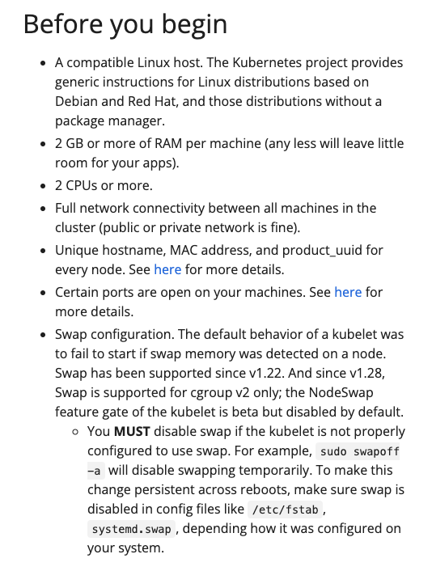

# 2-2. 도커 쿠버네티스 설치 / PC에 직접 설치하기

> CNI (Container Network Interface)
> 

컨ㅔ이너와 컨테이너가 통신할 수 있는 일종의 소프트웨어.

쿠버네티스를 쓰려면 반드신 CNI가 설치되어 있어야 한다. 

플라넬, 칼리코, 위브넷..

# EC2에 k8s 환경 설치하기

### docker 설치

> [https://docs.docker.com/engine/install/ubuntu/](https://docs.docker.com/engine/install/ubuntu/)
> 

설치하려는 시기와 버전에 따라 명령어는 상이할 수 있다.

그래서 공홈의 명령어를 그때 그때 참고해서 써야함.

아래는 내가 실습하면서 참고한 공홈의 명령어이다.

```bash
# Add Docker's official GPG key:
sudo apt-get update
sudo apt-get install -y ca-certificates curl
sudo install -m 0755 -d /etc/apt/keyrings
sudo curl -fsSL https://download.docker.com/linux/ubuntu/gpg -o /etc/apt/keyrings/docker.asc
sudo chmod a+r /etc/apt/keyrings/docker.asc

# Add the repository to Apt sources:
echo \
  "deb [arch=$(dpkg --print-architecture) signed-by=/etc/apt/keyrings/docker.asc] https://download.docker.com/linux/ubuntu \
  $(. /etc/os-release && echo "$VERSION_CODENAME") stable" | \
  sudo tee /etc/apt/sources.list.d/docker.list > /dev/null
sudo apt-get update

sudo apt-get install -y docker-ce docker-ce-cli containerd.io docker-buildx-plugin docker-compose-plugin
```

서버 실행할 때마다 docker 자동으로 실행시키기

```bash
sudo systemctl enable docker
sudo systemctl start docker
sudo docker version

```

### 1. k8s 설치

> documentation > Installing Kubernetes with deployment tools
> 

공홈링크: [https://kubernetes.io/docs/setup/production-environment/tools/kubeadm/install-kubeadm/](https://kubernetes.io/docs/setup/production-environment/tools/kubeadm/install-kubeadm/)



<aside>
💡 Swap configuration. The default behavior of a kubelet was to fail to start if swap memory was detected on a node. Swap has been supported since v1.22. And since v1.28, Swap is supported for cgroup v2 only; the NodeSwap feature gate of the kubelet is beta but disabled by default. You **MUST** disable swap if the kubelet is not properly configured to use swap. For example, `sudo swapoff -a` will disable swapping temporarily. To make this change persistent across reboots, make sure swap is disabled in config files like `/etc/fstab`, `systemd.swap`, depending how it was configured on your system.

</aside>

**swap disable**

```bash
sudo swapoff -a && sudo sed -i '/swap/s/^/#/' /etc/fstab
```

**방화벽 해제**

```bash
sudo systemctl stop firewalld
sudo systemctl disable firewalld
```

<aside>
⚠️ 이 부분 firewalld 가 없어서 실행되지 않고 있음.
방화벽과 관련된 문제가 생기면 다시 확인해봐야함.

</aside>

### 2. **kubeadm, kubelet, kubectl 설치**

```bash
sudo apt-get update
# apt-transport-https may be a dummy package; if so, you can skip that package
sudo apt-get install -y apt-transport-https ca-certificates curl gpg

# If the folder `/etc/apt/keyrings` does not exist, it should be created before the curl command, read the note below.
# sudo mkdir -p -m 755 /etc/apt/keyrings
curl -fsSL https://pkgs.k8s.io/core:/stable:/v1.29/deb/Release.key | sudo gpg --dearmor -o /etc/apt/keyrings/kubernetes-apt-keyring.gpg

# This overwrites any existing configuration in /etc/apt/sources.list.d/kubernetes.list
echo 'deb [signed-by=/etc/apt/keyrings/kubernetes-apt-keyring.gpg] https://pkgs.k8s.io/core:/stable:/v1.29/deb/ /' | sudo tee /etc/apt/sources.list.d/kubernetes.list

sudo apt-get update
sudo apt-get install -y kubelet kubeadm kubectl
sudo apt-mark hold kubelet kubeadm kubectl
```

```bash
sudo systemctl start kubelet
sudo systemctl enable kubelet
```

### 클러스터 만들기 with kubeadm

[https://kubernetes.io/docs/setup/production-environment/tools/kubeadm/create-cluster-kubeadm/](https://kubernetes.io/docs/setup/production-environment/tools/kubeadm/create-cluster-kubeadm/)

control-plan node 는 master node에만 만들어야 한다.

```bash
sudo kubeadm init --v=5
```

→ 이거실패하고있음…

- error message: validate service connection: validate CRI v1 runtime API for endpoint \"unix:///var/run/containerd/containerd.sock\
    
    <aside>
    ⚠️ [preflight] Running pre-flight checks
    error execution phase preflight: [preflight] Some fatal errors occurred:
    	[ERROR CRI]: container runtime is not running: output: time="2024-02-04T10:46:58Z" level=fatal msg="validate service connection: validate CRI v1 runtime API for endpoint \"unix:///var/run/containerd/containerd.sock\": rpc error: code = Unimplemented desc = unknown service runtime.v1.RuntimeService"
    , error: exit status 1
    
    </aside>
    
    1. config.toml 삭제
    
    ```bash
    rm /etc/containerd/config.toml
    ```
    
    1. containerd 재시작
    
    ```bash
    systemctl restart containerd
    ```
    
    1. control-plan node 만들기 재시도
    
    ```bash
    kubeadm init
    ```
    

- error execution phase addon/kube-proxy: error when creating kube-proxy service account: unable to create serviceaccount: rpc error: code = Unknown desc = malformed header: missing HTTP content-type
    
    <aside>
    ⚠️ error execution phase addon/kube-proxy: error when creating kube-proxy service account: unable to create serviceaccount: rpc error: code = Unknown desc = malformed header: missing HTTP content-type
    To see the stack trace of this error execute with --v=5 or higher
    
    </aside>
    
    위에꺼 해결하니 또 이런문제 생김..
    
    다시 `sudo kubeadm init` 해줄랬더니 이미 설치가 진행중에 실패했던거라 리셋을 해줘야했다.
    
    1. kubeadm reset
    
    ```bash
    sudo kubeadm init --v=5
    ```
    
    리셋도 하다가 뭔 에러 나서 —v=5 붙혀줌…
    
    1. sudo kubeadm init
    
    ```bash
    sudo kubeadm init --v=5
    ```
    
    버전붙혀줘야되는거같아서 해줬더니 잘됨;;;
    

성공하면 이런 메시지가 쭉 출력된다.

<aside>
💡 Your Kubernetes control-plane has initialized successfully!

To start using your cluster, you need to run the following as a regular user:

mkdir -p $HOME/.kube
sudo cp -i /etc/kubernetes/admin.conf $HOME/.kube/config
sudo chown $(id -u):$(id -g) $HOME/.kube/config

Alternatively, if you are the root user, you can run:

export KUBECONFIG=/etc/kubernetes/admin.conf

You should now deploy a pod network to the cluster.
Run "kubectl apply -f [podnetwork].yaml" with one of the options listed at:
[https://kubernetes.io/docs/concepts/cluster-administration/addons/](https://kubernetes.io/docs/concepts/cluster-administration/addons/)

Then you can join any number of worker nodes by running the following on each as root:

kubeadm join 172.31.38.52:6443 --token 31nm47.vsuzgagfldwbf5nv \
--discovery-token-ca-cert-hash sha256:8bb077e5b8be2c7a95ace8373c4943c241aa3c42ac148320d9405d611d2bb1a5

</aside>

쭉 설명과 함께 토큰이 있음.

일단 토큰부터 저장하자.

<aside>
⚠️ 토큰~

kubeadm join 172.31.38.52:6443 --token 31nm47.vsuzgagfldwbf5nv \
--discovery-token-ca-cert-hash sha256:8bb077e5b8be2c7a95ace8373c4943c241aa3c42ac148320d9405d611d2bb1a5

</aside>

워커노드들이 이거로 조인할 수 있도록 사용할 것이다. 이걸 보관해놔야된다.

```bash
cat > token.txt
```

cat > token.txt

To Start~ 부분을 보면사용자들이 사용할 수 있게 뭐 실행해줘야된다.

실행해주고 노드확인

주의할점은 sudo는 빼고 해야함. 이유는 찾아보도록하자.

```bash
kubectl get nodes
```

### 3. **Installing a Pod network add-on**

어쩌고 복잡하니 강사님 깃헙의 코드를 사용하라고 하신다.

[https://github.com/237summit/k8s_core_labs?tab=readme-ov-file#installing-a-pod-network-add-on](https://github.com/237summit/k8s_core_labs?tab=readme-ov-file#installing-a-pod-network-add-on)

---

으으…개빡친다 설정하다가 뭐안되고 안되고…

다행히 선생님이 EC2 노션설명링크달아놓은거 발견함 ㄷㄷ

[**Set up a K8S(v1.25) cluster on AWS EC2( Ubuntu 22.04)**](https://www.notion.so/Set-up-a-K8S-v1-25-cluster-on-AWS-EC2-Ubuntu-22-04-c3c059755dad4c6882cacb7337c2c812?pvs=21)