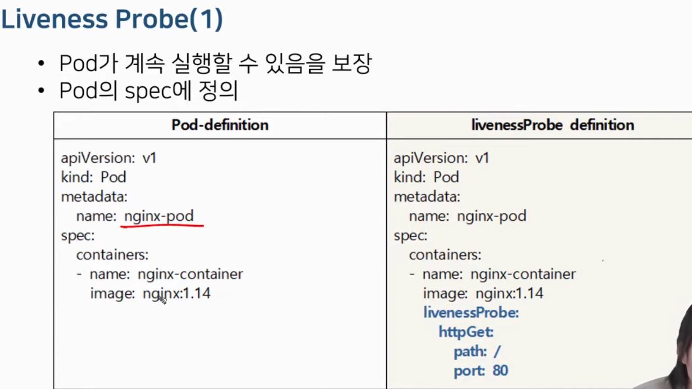
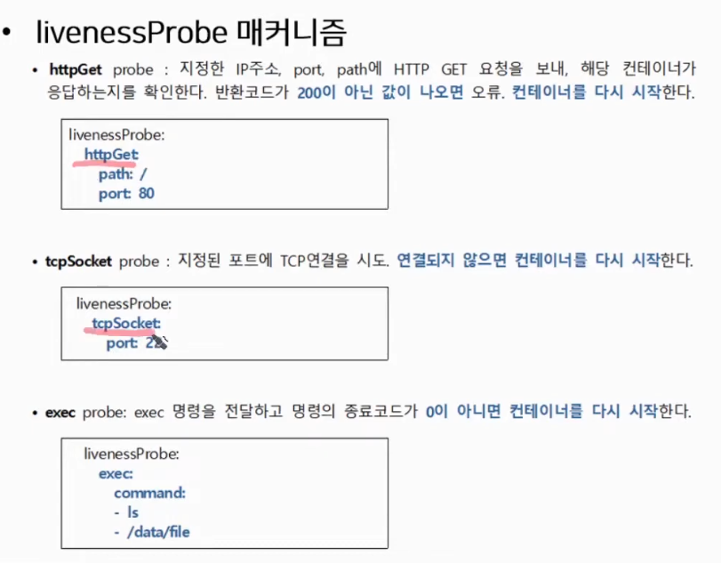

# 5-2. 쿠버네티스 Pod - livenessProbe를 이용해서 Self-healing Pod 만들기

쿠버네티스의 기능 중 하나

Self-healing

건강한 컨테이너로 어플리캐이션이 동작하도록 보장해준다.

### livenessProbe



컨테이너별로 검진 방법이 다르다.



httpGet: 웹 기반 컨테이너 건강검진. 200응답으로 건강 판단.

tcpSocket: 웹소캣 건강검진. 

건강하지 않다고 판단되면? (3번 시도)

- 해당 컨테이너를 죽인다.
- 허브에서 건강한 컨테이너를 다시 받아서 실행한다. (restart)

파드가 아닌 컨테이너를!

그래서 파드의 ip는 그대로임

```bash
# pod-nginx-liveness.yaml
apiVersion: v1
kind: Pod
metadata:
  name: nginx-pod
spec:
  containers:
  - name: nginx-container
    image: nginx:1.14
    ports:
    - containerPort: 80
      protocol: TCP
    livenessPorobe:
      httpGet:
        path: /
        port: 80

```