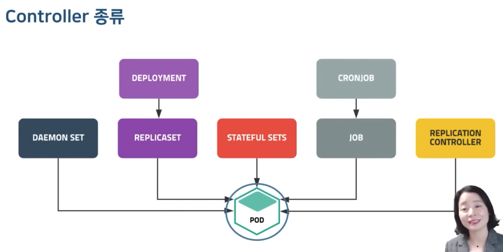
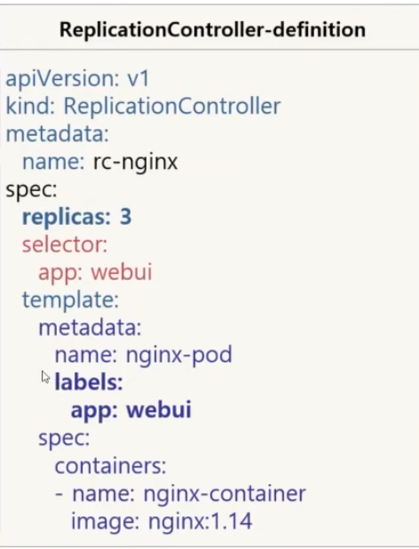
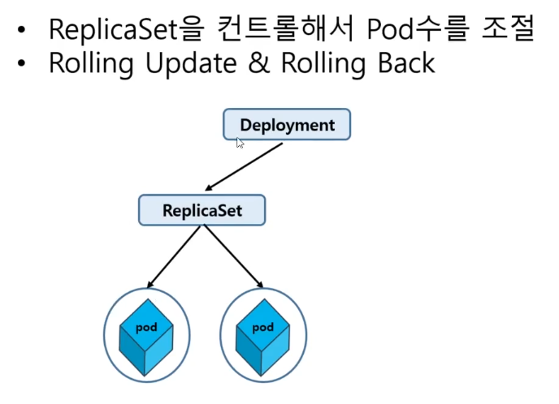
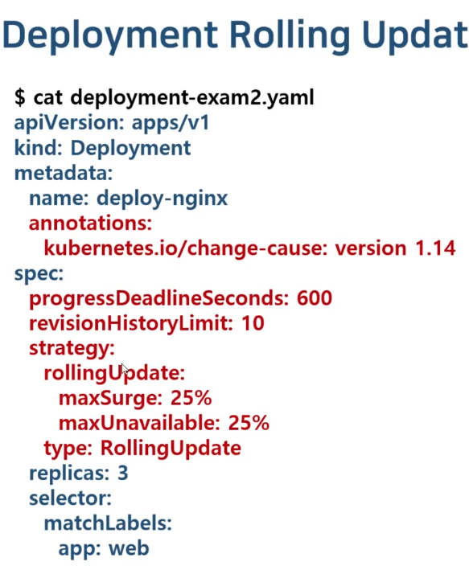

# 6. Controller

태그: CronJob, DaemonSet, Deployment, Job, ReplicaSet, RollingUpdate, StatefulSet

6. Controller

- 컨트롤러: Pod의 개수를 보장



# 6-1. ReplicationController

요구하는 파드의 개수를 보장함

파드 집합의 실행을 항상 안정적으로 유지하는 것을 목표

- 파드 개수가 부족하면 template을 이용해 파드를 추가
- 요구하는 파드수보다 많으면 최근에 생성된 파드를 삭제

기본구성

- selector
- replicas
- template



labels와 동일한 selector를 본다.

해당 key value에 해당하는 래플리카를 보장해준다.

매칭되는 템플릿을 보장한다.

```bash
# 풀네임으로 보기
kubectl get replicationcontrollers
# 별명으로 보기
kubectl get rc
# 자세히 보기
kubectl describe rc rc-nginx
```

```bash
# 레디스를 라벨 붙혀서 만들기 확인 (dry-run)
kubectl run redis --image=redis --labels=app=webui --dry-run

# 레디스를 라벨 붙혀서 만들기 yaml 확인
kubectl run redis --image=redis --labels=app=webui --dry-run -o yaml

# yaml을 redis.yaml로 만들기
kubectl run redis --image=redis --labels=app=webui --dry-run -o yaml > redis.yaml
```

```bash
# 실행중인 라벨들 보기
kubectl get pods --show-labels
```

```bash
# edit으로 레플리카 늘리기
kubectl edit rc rc-nginx
## 파일 속 replicas 를 3->4로 늘려서 wq 하면 바로 늘어남

# scale로 레플리카 줄이기
kubectl scale rc rc-nginx --replicas=2
## 바로 줄어듦
```

### edit 에서 템플릿 이미지를 바꾸면 어떻게 될까?

아무일도 안일어남.

왜냐면 selector만 보고 움직임!

그치만 파드가 죽어서 다시 만들게되면 새로운 조건의 이미지로 만들어진다.

# 6-2.ReplicaSet

```bash
# ReplicationSelector
selector: # app=webui, version=2.1 는 & 조건으로 체크한다
  app: webui
  version: "2.1"

# **ReplicaSet**
selector:
  **matchLabels**: # 이건 무조건 해당되야하는 필수조건
    app: webui 
  **matchExpressions**: # 이 조건에서 해당하면 된다.
  - {key: version, operator: In, value: ["2.1", "2.2"]}
```

**matchExpressions**

- In: key와 values를 지정하여 key,value가 일치하는 Pod만 연결
- NotIn: key는 일치하고 value는 일치하지 않는 Pod에 연결
- Exists: Key에 맞는 label의 Pod를 연결
- DoesNotExist: Key와 다른 label의 Pod를 연결

### 살아있는 파드는 놔두고 컨트롤러만 삭제하고 싶으면? `--cascade=false`

```bash
kubectl delete rs rs-nginx --cascade=false
```

# 6-3. **쿠버네티스 RollingUpdate를 위한 Deployment**



Rolling update : [https://kubernetes.io/ko/docs/tutorials/kubernetes-basics/update/update-intro/](https://kubernetes.io/ko/docs/tutorials/kubernetes-basics/update/update-intro/)

문서가 잘 되어있음.

ReplicaSet과 파일보면 Kind만 다름!

실습파일: deployment-nginx.yaml

NAME                               READY   STATUS    RESTARTS   AGE
pod/deploy-nginx-bd76d5967-5wnfs   1/1     Running   0          19s
pod/deploy-nginx-bd76d5967-fvbcd   1/1     Running   0          19s
pod/deploy-nginx-bd76d5967-z8tgb   1/1     Running   0          19s

생성파일명 보면 끝이  컨트롤러-디플로이 라고 보면된다.

여기서  ‘deploy-nginx-bd76d5967’ rs를 삭제해주면, deployment에 의해 다시 생성된다!

```bash
# 파일: deployment-exam1.yaml
kubectl create -f deployment-exam1.yaml --record

kubectl set image deploy app-deploy web=nginx:1.15 --record
```

### rollout

Available Commands:
- history       View rollout history
- pause         Mark the provided resource as paused
- restart       Restart a resource
- resume        Resume a paused resource
- status        Show the status of the rollout
- undo          Undo a previous rollout

```bash
# 히스토리 보기! 명령어 칠때부터 --record 붙혀주면 여기에 남음
kubectl rollout history deployment app-deploy
```



annotations로 바로 업데이트 가능하다!

# 6-3.  **쿠버네티스 DaemonSet! + RollingUpdate**

### DaemonSet

- 전체 노드에서 Pod가 **한개씩** 실행되도록 보장
- 로그 수집기, 모니터링 에이전트와 같은 프로그램 실행 시 적용

### ReplicaSet vs DemonSet

- 레플리카셋은 레플리카 갯수를 선언해줘야하고 1개 이상의 숫자를 지정할 수 있다
- 데몬셋은 기본적으로 1개를 보장하기 때문에 1개만 필요하면 더 편함

실습파일: daemonset-exam.yaml

해당 데몬셋을 만들어놓으면 이를 통해만들어진 파드를 삭제했을 때 다시 만들어지는 것을 확인할 수 있다.

# **6-5. 쿠버네티스 StatefulSet**

**StatefulSet: 파드의 상태를 유지해주는 컨트롤러**

다른 컨트롤러는 갯수를 유지시켜주지만, 이름이 렌덤해시라서 보장이되지않음.

StatefulSet은 이름보장을 해줌 (순차적으로 1,2,3…)

실습파일: statefulset-exam.yaml

```bash
apiVersion: apps/v1
kind: StatefulSet
metadata:
  name: sf-nginx
spec:
  replicas: 3
  **serviceName: sf-service**
  **podManagementPolicy: Parallel #** OrderedReady
  selector:
    matchLabels:
      app: webui
  template:
    metadata:
      name: nginx-pod
      labels:
        app: webui
    spec:
      containers:
      - name: nginx-container
        image: nginx:1.14
```

# **6-6. 쿠버네티스 Job Controller**

kubectl run testpod --image=centos:7 --command sleep 5

```bash
testpod                 0/1     Pending             0          0s      <none>         <none>     <none>           <none>
testpod                 0/1     Pending             0          0s      <none>         minikube   <none>           <none>
testpod                 0/1     ContainerCreating   0          0s      <none>         minikube   <none>           <none>
testpod                 1/1     Running             0          2s      10.244.0.109   minikube   <none>           <none>
testpod                 0/1     Completed           0          7s      10.244.0.109   minikube   <none>           <none>
testpod                 1/1     Running             1 (2s ago)   8s      10.244.0.109   minikube   <none>           <none>
testpod                 0/1     Completed           1 (7s ago)   13s     10.244.0.109   minikube   <none>           <none>
testpod                 0/1     CrashLoopBackOff    1 (16s ago)   28s     10.244.0.109   minikube   <none>           <none>
testpod                 1/1     Running             2 (16s ago)   28s     10.244.0.109   minikube   <none>           <none>
testpod                 0/1     Completed           2 (21s ago)   33s     10.244.0.109   minikube   <none>           <none>
```

- Pod를 running 중인 상태로 유지
- Batch 처리하는 Pod는 작업이 완료되면 종료됨
- Batch 처리에 적합한 컨트롤러로 Pod의 성공적인 완료를 보장
    - 비정상 종료 시 다시 실행
    - 정상 종료 시 완료

실습파일: job-exam.yaml

```bash
apiVersion: batch/v1
kind: Job
metadata:
  name: centos-job
spec:
#  completions: 5
#  parallelism: 2
  activeDeadlineSeconds: 5 # 최대 대기 초
  template:
    spec:
      containers:
      - name: centos-container
        image: centos:7
        command: ["bash"]
        args:
        - "-c"
        - "echo 'Hello World'; sleep 25; echo 'Bye'"
      restartPolicy: Never # Never, OnFailure
#  backoffLimit: 3
```

# **6-7. 쿠버네티스 CronJob / 컨트롤러 총정리!**

cronJob :

크론 스케줄링 기능을 Job Controller에 추가한 API

“min hour month dayofmonth month dayofweek”

- min: 0~59
- hour: 0~23
- dayofmonth: 1~31
- month: 1~12
- dayofweek: 0~6 (일~토) (주중: 1-5, 주말: 0,6)

”0 3 1 * *” : 매월 1일 3시 정각마다 실행