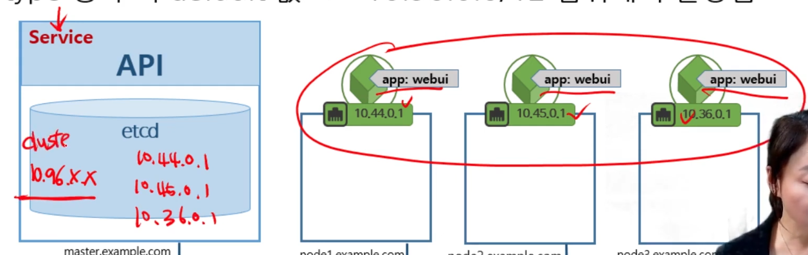
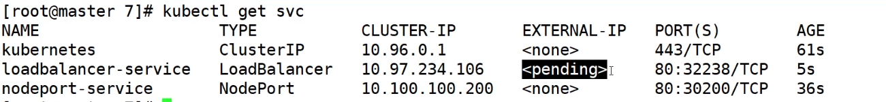
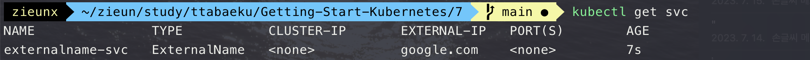
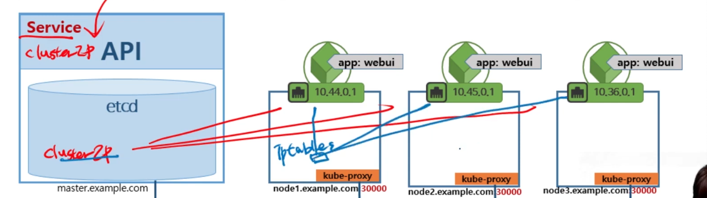
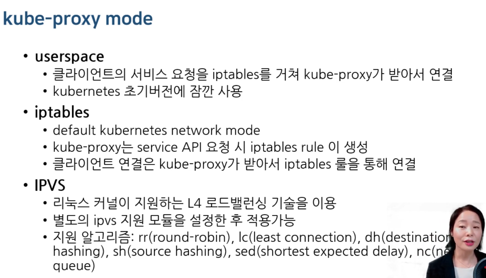

# 7. Service

태그: ClusterIP, ExternalName, Headless Service, Kube Proxy, LoadBalancer, NodePort, service

# **7-1. 쿠버네티스 Service 개념과 종류**

Service: Pod 그룹의 단일 진입점



### Service Type

- ClusterIP
- NodePort
    - ClusterIP가 기본적으로 있음. 각 노드 포트들의 IP들이 오픈됨
- LoadBalancer
    - LoadBalancer(LB) 장비를 쿠버네티스 내부 포트와 연결해줌. (외부 클라우드 서비스 혹은 자체구축으로 가능)
- ExternalName

# **7-2. 쿠버네티스 Service 4가지 종류 실습해보기**

## 1. ClusterIP

- 컨트롤러로 설정한 갯수만큼 Pod들은 각각 IP와 함께 생성된다.
- Service를 레이블로 구분해서 하나로 묶어서 만들 수 있다.

실습 파일: clusterip-nginx.yaml,  deploy-nginx.yaml

 deploy-nginx.yaml로 파드 만든다.

```bash
apiVersion: v1
kind: Service
metadata:
  name: clusterip-service
spec:
  type: **ClusterIP**
  **clusterIP: 10.100.100.100**
  selector:
    app: webui # deploy-nginx.yam 로 만든 app name
  ports:
  - protocol: TCP
    port: 80
    targetPort: 80
```

‘10.100.100.100’ 로 요청하면 랜덤하게 로드밸런스를 맞춰준다.

순차적으로 접근하지 않음!

## NodePort

실습파일: nodeport-nginx.yaml

```bash
apiVersion: v1
kind: Service
metadata:
  name: nodeport-service
spec:
  type: **NodePort**
  clusterIP: 10.100.100.200
  selector:
    app: webui
  ports:
  - protocol: TCP
    port: 80
    targetPort: 80
    **nodePort: 30200**
```

## LoadBalancer

Public cloud 환경에서만 가능하다.

실습파일: loadbalancer-nginx.yaml

(그냥 확인만 해보자)

```bash
apiVersion: v1
kind: Service
metadata:
  name: loadbalancer-service
spec:
  type: **LoadBalancer**
  selector:
    app: webui
  ports:
  - protocol: TCP
    port: 80
    targetPort: 80
```

실제 클라우드 환경에서 하면, EXTERNAL_IP 가 세팅된다.



## ExternalName

클러스터 내부에서 External의 도메인을 설정

**DNS를 지원**

실습파일: external-name.yaml

```bash
apiVersion: v1
kind: Service
metadata:
  name: externalname-svc
spec:
  type: **ExternalName**
  **externalName: google.com**
```



# **7-3. 쿠버네티스 Headless Service와 Kube Proxy 강좌**

## Headless Service

- 클러스터아이피가 없는 서비스로 단일 진입점이 필요 없을 대 사용
- 서비스와 연결된 파드의 엔드포인트로 DNS 레코드가 생성됨
- Pod DNS 주소: ~

실습파일: headless-nginx.yaml, deploy-nginx.yaml

deploy-nginx.yaml 실행한다.

```bash
apiVersion: v1
kind: Service
metadata:
  name: headless-service
spec:
  type: **ClusterIP**
  **clusterIP: None**
  selector:
    app: webui
  ports:
  - protocol: TCP
    port: 80
    targetPort: 80
```

```bash
kubectl run testpod --image=centos:7 /bin/bash
# 바로접속

# 만든 testpod ip를 dash 로 붙혀서 pod-ip-addr 로 DNS 만들 수 있다.
# ip가 고정으로 만드는 경우 유용하다.
curl 10-244-0-131.default.pod.cluster.local
```

## kube-proxy



- endpoint 연결을 위한 **iptables** 룰을 만들어서 구성
- nodePort 로의 접근과 Pod 연결을 구현
- 각각 노드에 kube-proxy 가 동작함

```bash
# 실행중인 kube-proxy를 확인하기
kubectl get pods --all-namespaces
```

