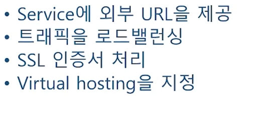

# 8. Ingress

태그: Ingress, Ingress Controller

# **8-1 Kubernetes Ingress 개념과 Ingress Controller 설치!**

**Kubernetes Ingress**

- API 종류 중 하나
- HTTP,HTTPS 를 통해 클러스터 내부의 서비스를 외부로 노출
    
    
    

# **8-2 Kubernetes Ingress 실습 - 웹페이지 구현**