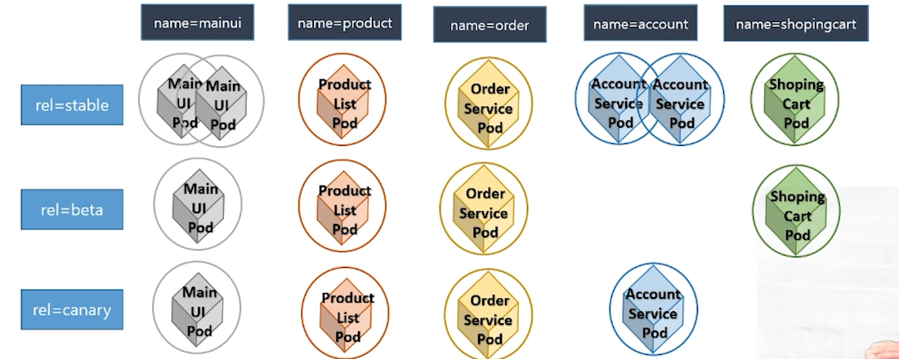
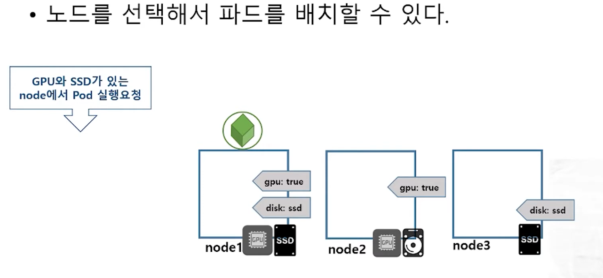
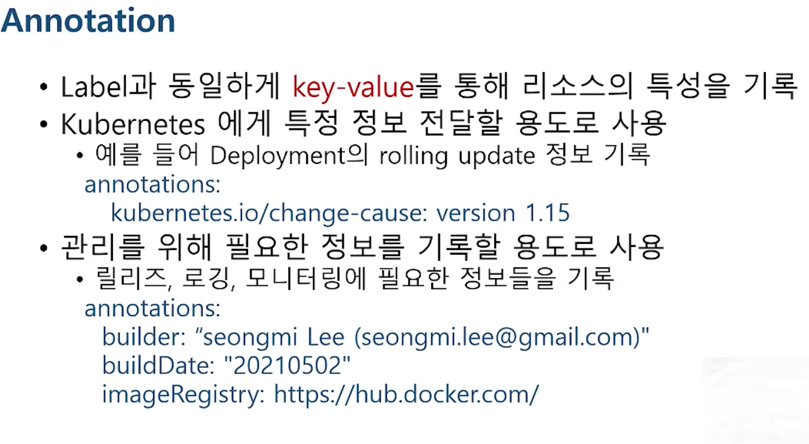
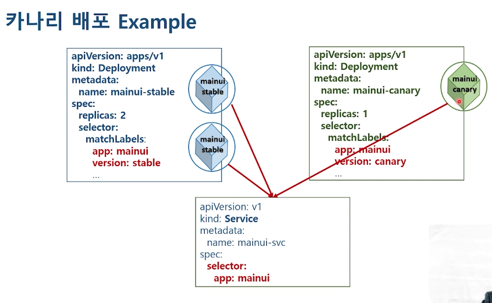

# 9. Label

태그: Annotation, Canary(카나리), Label

# **9-1. kubernetes label 쿠버네티스 레이블**

### Label

- 노드를 포함하여 Pod, deployment 등 모든 리소스에 할당
- 많은 종류의 리소스들을 분류할 목적으로 분류해주는 것
- key-value 한 쌍으로 적용
- selector를 이용해서 선택의 기준
    
    
    

[https://kubernetes.io/ko/docs/concepts/overview/working-with-objects/labels/](https://kubernetes.io/ko/docs/concepts/overview/working-with-objects/labels/)

[https://kubernetes.io/ko/docs/concepts/overview/working-with-objects/labels/#구문과-캐릭터-셋](https://kubernetes.io/ko/docs/concepts/overview/working-with-objects/labels/#%EA%B5%AC%EB%AC%B8%EA%B3%BC-%EC%BA%90%EB%A6%AD%ED%84%B0-%EC%85%8B)

여기서 제공하는 내용으로 레이블 있는것과 없는것 두 가지 파일을 만들어서 실행해보자.

```bash
#pod1.yaml - 레이블 없는 것

apiVersion: v1
kind: Pod
metadata:
  name: pod-demo
spec:
  containers:
  - name: nginx
    image: nginx:1.14
    ports:
    - containerPort: 80

# pod2.yaml - 레이블 있는 것
apiVersion: v1
kind: Pod
metadata:
  name: label-pod-demo
  labels:
    name: mainui
    rel: stable
spec:
  containers:
  - name: nginx
    image: nginx:1.14
    ports:
    - containerPort: 80
```

만들고 `kubectl get pods --show-labels` 쳐보자.

```bash
NAME                    READY   STATUS    RESTARTS   AGE     LABELS
cmdpod                  1/1     Running   0          7m30s   run=cmdpod
label-pod-demo          1/1     Running   0          2m19s   name=mainui,rel=stable
pod-demo                1/1     Running   0          2m19s   <none>
```

`kubectl get pods -l name=mainui` selector를 붙혀서 쳐보자. (혹은 rel=stable)

```bash
NAME             READY   STATUS    RESTARTS   AGE
label-pod-demo   1/1     Running   0          3m2s
```

파드에 레이블을 추가해보자.

```bash
kubectl label pod pod-demo name=test

# 다시 name 속성으로 레이블 지정하려고 하면 에러남! 그래서 --overwrite 속성을 붙혀줘야한다.
kubectl label pod pod-demo name=test2 --overwrite

kubectl label pod cmdpod name=order rel=beta

# label 삭제 = 대시문자
kubectl label pod cmdpod run- # run 레이블을 삭제
```

# **9-2. kubernetes node label**

- Worker Node의 특성을 Label로 설정
    
    
    

실습파일: nodeselector.yaml

# **9-3. kubernetes annotation**



1. 정보전달 용도로 사용
2. 리소스의 정보를 넣어서 운영자에게 전달할 목적

실습파일: annotaion.yaml

```bash
apiVersion: v1
kind: Pod
metadata:
  name: pod-annotation
  annotations:
    bilder: "jieun (zieunx95@gmail.com)"
    buildDate: "20240313"
    imageRegistry: http://hub.docker.com/
spec:
  containers:
  - name: nginx
    image: nginx:1.14
    ports:
    - containerPort: 80
```

describe 로 조회하면 annotations를 볼 수 있다.

# **9-4. kubernetes Canary Deployment**

- 포드를 배포하는 방법
    - 블루그린
    - 카나리
    - 롤링
- 카나리
    - 기존 버전을 유지한 채로 일부 버전만 신규버전으로 올려서 신규버전에 버그나 이상은 없는지 확인
    
    
    
    실습파일: mainui-stable.yaml, mainui-service.yaml, mainui-canary.yaml
    
    ```bash
    # mainui-canary.yaml
    apiVersion: apps/v1
    kind: Deployment
    metadata:
      name: mainui-canary
    spec:
      replicas: 1
      selector:
        matchLabels:
          app: mainui
          **version: canary**
      template:
        metadata:
          labels:
            app: mainui
            version: canary
        spec:
          containers:
          - name: mainui
            image: nginx:1.15
            ports:
            - containerPort: 80
    ```